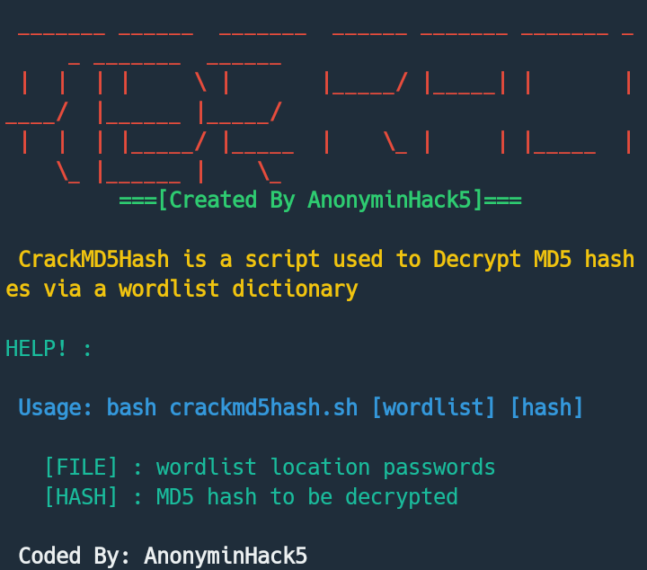

#CrackMD5Hash
Crack md5 hash is a shell script used to decipher and crack MD5 hashes via a wordlist dictionary. 

# Prequistics
#### [1] A wordlist dictionary is needed for the script to work
#### [2] MD5 hashes

# Tested on
This script has been tested and works on the following systems

#### [1] Linux
#### [2] Lubuntu
#### [3] Termux
#### [4] Git bash

# Author
<h4>AnonyminHack5</h4>

<h3>Language: 
Shell Script
</h3>

Make sure the hash been cracked is an MD5 hash else script won't work. 

# Screenshot 

# Installation in Linux
> sudo apt update 
> git clone https://github.com/TermuxHackz/CrackMD5Hash
> cd CrackMD5Hash/
> chmod +x crackmd5hash.sh
> ./crackhash.sh

# Installation in Termux

> pkg update

> git clone https://github.com/TermuxHackz/CrackMD5Hash

> cd CrackMD5Hash

> bash crackhash.sh

Thanks for using this script. You can star/fork repo

# Having Issues
If you encounter bugs or errors while using the script kindly mail me those errors to me 📫 at <b>AnonyminHack5@protonmail.com</b> and i will do well to answer your queries as soon as i see it. 

# Follow me 
####>>> [1] <a href="https://t.me/termuxhackz1">Join telegram channel</a>
####>>> [2] <a href="https://t.me/Termux1_bot">Contact me telegram hacking tutorial bot</a>
####>>> [3] <a href="https://chat.whatsapp.com/IIt3FtoimjL1LcdKqDm5o2">Join our whatsapp Group</a>
####>>> [4] <a href="https://www.facebook.com/groups/423043615428159/?ref=share">Join our Facebook Group</a>
 

